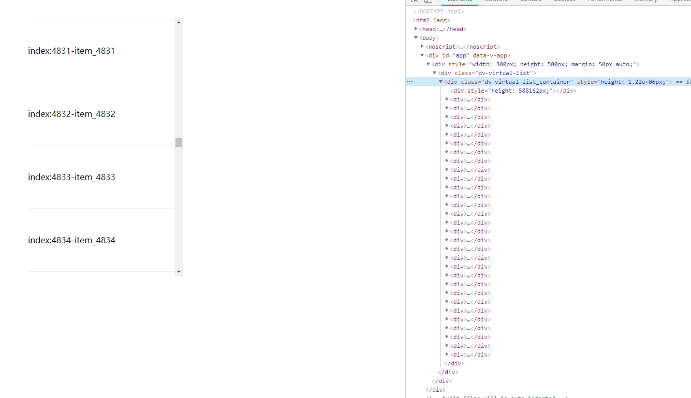

# vue3-virtual-list

基于vue3的虚拟列表

## 安装

### npm

```js
npm install @webdevil/vue3-virtual-list --save
```

### yarn

```js
yarn add @webdevil/vue3-virtual-list
```

## 使用

```js
<template>
  <div style="width: 300px; height: 500px; margin: 50px auto;">
    <virtual-list :items="items" itemKey="id">
      <template v-slot="{ item, index }">
        <div style="padding: 50px; border-bottom: 1px solid #eee">index：{{ index }}-{{ item.name }}</div>
      </template>
    </virtual-list>
  </div>
</template>

// js
import { defineComponent, onMounted, ref } from 'vue'
import VirtualList from '@webdevil/vue3-virtual-list'
import "@webdevil/vue3-virtual-list/lib/index.css"

interface IItems {
  name: string;
  id: number
}

export default defineComponent({
  name: 'VirtualListDemo',
  components: {
    VirtualList
  },
  setup() {
    // 所有数据列表
    const items = ref<IItems[]>([])

    onMounted(() => {
      const list: IItems[] = []
      for(let i=0;i<10000; i++) {
        list.push({
          name: 'item_' + i,
          id: i
        })
      }
      items.value = list
    })

    return {
      items
    }
  }
})
```

## props参数

| prop | 说明 | 类型 | 默认值 |
| --- | --- | --- | --- |
| items | 需要显示的所有列表数据 | any[] | 必填 |
| distance | 顶部内卷条数，滚动区域上部分数据超过该值，则会触发更新 | number | 10 |
| showLength | 显示的数据条数 | number | 30 |
| itemKey | vue循环列表的key | string | 默认取数据的index |

## slot参数

| | 说明 |
| --- | --- |
| item | 对应items中的每一项 |
| index | 在items中的索引 |

## 效果展示



## 源码地址

[github](https://github.com/Li-DaDa/vue3-virtual-list)
